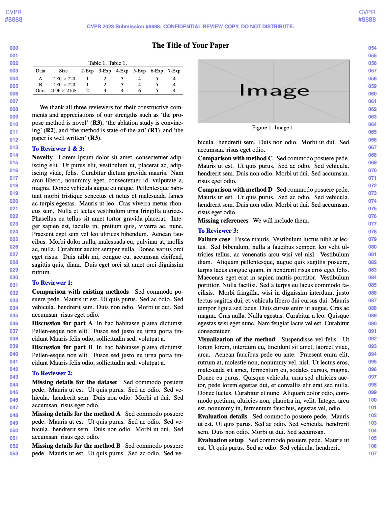
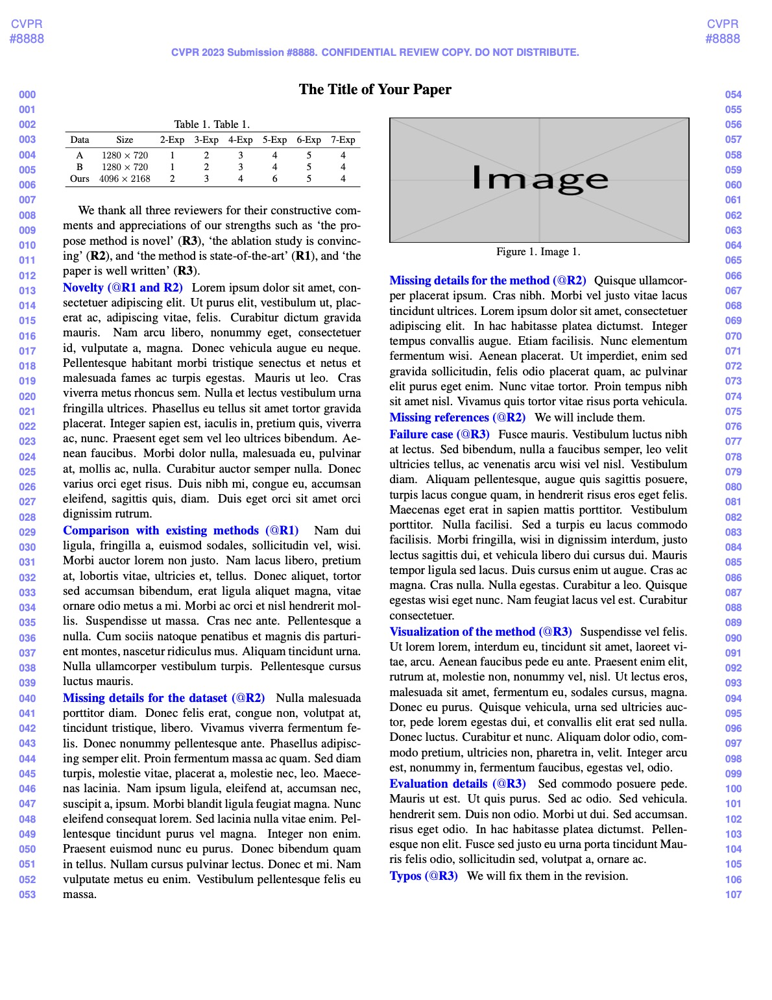

# Rebuttal Template for CV Conference

This repo provides two LaTex templates for preparing the rebuttal for CV conferences (e.g., CVPR/ICCV).

Overleaf Link: https://www.overleaf.com/read/wqhjmsbhdrxp.

## Example 1
This template groups the responses for each reviewer. It is useful when different reviewers have different questions, and there are many small questions to answer for each reviewer.

    

## Example 2
This template answers each question one by one, and refers to the corresponding reviewers at the end of each question.

    

## More LaTeX Resources
- [latex_paper_writing_tips](https://github.com/guanyingc/latex_paper_writing_tips)
